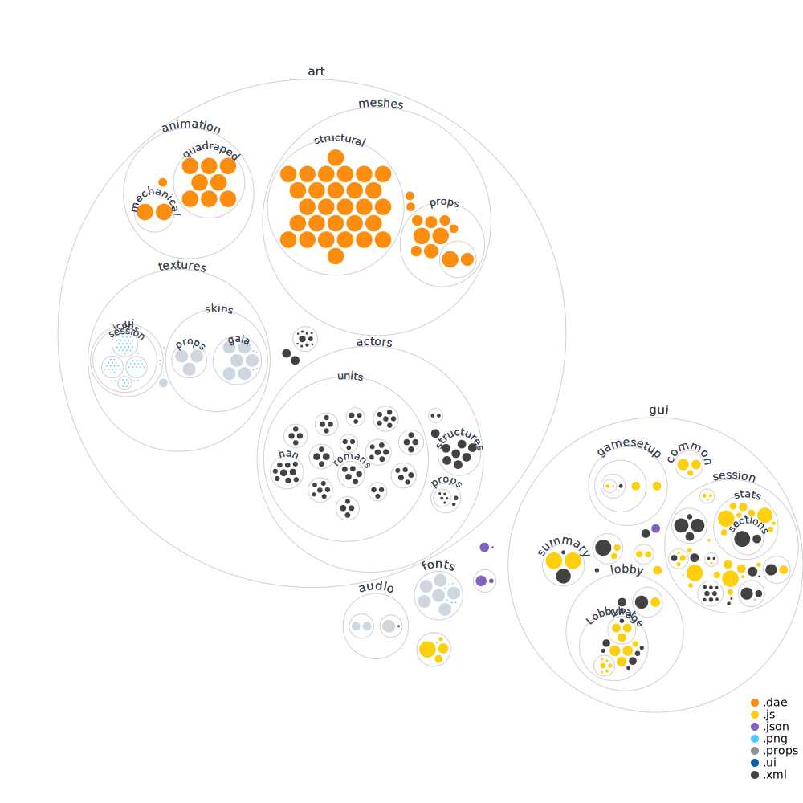

<!-- Title -->
<div align="center">

# boonGUI <br>

<p>
<a href="https://github.com/LangLangBart/boonGUI/releases"></a>
<a href="https://play0ad.com/download/"></a>
<a href="https://wildfiregames.com/forum/topic/37147-boongui/"></a>
<a href="https://wildfiregames.com/forum/topic/37147-boongui/"></a>
</p>

<p>
<!-- dev badges -->
<a href="https://github.com/LangLangBart/boonGUI/commits/main"></a>
<a href="https://github.com/LangLangBart/boonGUI/graphs/contributors"></a>
<a href="https://github.com/LangLangBart/boonGUI/commits/main"></a>
</p>

User interface **mod** for the RTS game **0 A.D.**

<!-- 0 A.D. logo -->

<a href="https://play0ad.com">

<h4>
  <a href="https://play0ad.com/re-release-of-0-a-d-alpha-25-yauna/">Website</a>
  <span> · </span>
  <a href="https://github.com/0ad/0ad">GitHub</a>
  <span> · </span>
  <a href="https://peertube.debian.social/videos/watch/7d134d11-0b25-42bc-92dd-13c496863e8e">Project Overview</a>
  <span> · </span>
  <a href="https://trac.wildfiregames.com/wiki/FAQ">FAQ</a>
</h4>

---

| <a href="https://www.youtube.com/channel/UC5Sf1aQufzzWATg9TJzg7mQ">  <a href="https://www.youtube.com/watch?v=CA2ZaEsDkiA"><br /> <a href="https://www.youtube.com/watch?v=CA2ZaEsDkiA" target="_blank"> | <a href="https://www.youtube.com/channel/UCnpCp_OvNm0_FgD_5rSrxbw"> <a href="https://www.youtube.com/watch?v=PhdbEN6UoG4"><br /> <a href="https://www.youtube.com/watch?v=PhdbEN6UoG4" target="_blank"> |
| :-------------------------------------------------------------------------------------------------------------------------------------------------------------------------------------------------------------------------------------------------------------------------------------------------------------------------------------------------------------------------------------------------------------------------------------------------------------------------------------------------------------------------------------------------------------------------------: | :-----------------------------------------------------------------------------------------------------------------------------------------------------------------------------------------------------------------------------------------------------------------------------------------------------------------------------------------------------------------------------------------------------------------------------------------------------------------------------------------------------------------------------------------------------------------------------------: |
|   <a href="https://www.youtube.com/channel/UCjF60pN4P6ZwTjn4e0_f0nw"> <a href="https://www.youtube.com/watch?v=aJBzP-UAMXI"><br /> <a href="https://www.youtube.com/watch?v=aJBzP-UAMXI" target="_blank">    |        <a href="https://www.youtube.com/channel/UCS-SFei6NFRuGN8CKtAsYrA"> <a href="https://www.youtube.com/watch?v=_DP_-WOARXo"><br /> <a href="https://www.youtube.com/watch?v=_DP_-WOARXo" target="_blank">         |

</div>

---

## ✨ Features

### 🕹 In-Game

- Large round mini map
- Extra in-game stats about the players
- Rally points are visible for observers.
- Bigger buttons for the construction panel
- All player colors and fruits have more vivid colors.
- Increased size for all weapon projectiles, chickens and garrison flags on every building.
- All heroes have a large visible object flowing over their head, making them easier to see on the battlefield.
- Individually selected units show attack and resistance values, relics show their auras and treasures show their contents.

### 🎯 Miscellaneous UI improvements

- **Camera:** Change the camera settings in the options.
- **Lobby:** Quick access buttons below the chat input.
- **Main menu:** New background image
- **Replays overview:** Adding a button next to the replay path for quick access to the directory.
- **Summary:** Increased the size, recommend to use a 1920×1080 display.
- **Trade:** Store the trading probabilities for each resource.

---

## 👨‍💻 Install

| System  | Default location for the `/0ad/mods/` folder |
| ------- | -------------------------------------------- |
| Linux   | `~/.local/share/0ad/mods/`                   |
| macOS   | `~/Library/Application\ Support/0ad/mods/`   |
| Windows | `~\Documents\My Games\0ad\mods\`             |

- Pick one of three ways to install the mod
  - **GitHub**
    - Clone it in your `/0ad/mods/` folder.
  - **Pyromod**
    - Drag the file over the 0ad start icon or double click it.
    - The mod gets unpacked and placed automatically in your `/0ad/mods/` folder.
  - **ZIP**
    - Unpack it in your `/0ad/mods/` folder.
- Start `0 A.D.`, click `Settings` and `Mod Selection`.
- Double-click `boonGUI`, click `Save Configuration` and `Start Mods`.

---

## 💪 Contributing

1. Fork it.
2. Create a new feature branch: `git checkout -b my-new-feature`
3. Commit your changes: `git add .` and `git commit -m 'Add some feature'`
4. Push it to the branch: `git push fork my-new-feature`
5. Submit a pull request.

<br>

### 👁 Code structure

Created with [RepoVisualize](https://github.com/githubocto/repo-visualizer), click to interact.
[](https://mango-dune-07a8b7110.1.azurestaticapps.net/?repo=LangLangBart%2FboonGUI)

### 🐛 Debug

- Debugging is done by inserting [logging](https://trac.wildfiregames.com/wiki/Logging#Scripts) functions into the suspected problematic code.
- All custom debug methods of boonGUI are accessible through the `d` object.

```js
d.assert(Object.getPrototypeOf(Object.prototype)); // "ASSERT FAIL: null"
d.group(); // +++++ groupStart +++++
d.groupEnd(); // ----- groupEnd -----
d.log("test1", g_HotkeyTags); // ["test1", {color:"255 251 131"}]
d.hasOwn(cmpTechnologyManager, "typeCountsByClass"); // true
d.inter([1, 2, 3], [3, 4]); // [3]
d.listProp(WeakMap.prototype); // ["constructor", "delete", "get", "has", "set"]
d.slow("test1", g_HotkeyTags); // same as "log", but the interval is every 2s (useful in a loop)
d.stack(); // stack trace
d.symDiff([1, 2, 3], [3, 4]); // [1, 2, 4]
d.time("Math time");
// Math.pow(295, 109)
d.timeEnd("Math time"); // Math time: 0.048ms
d.trueTypeOf(["😀", "🤢", "💩", "🎃"]); // array
d.union([1, 2, 3], [3, 4]); // [1, 2, 3, 4]
```

### 🔱 Git-Hook

Trivial problems in the code are handled with the [pre-commit](https://github.com/pre-commit/pre-commit) hook, customizations are set in the [.pre-commit-config.yaml](../.pre-commit-config.yaml).


<div align="center">

<p>
<a href="https://github.com/pre-commit/pre-commit"></a>
<a href="https://results.pre-commit.ci/latest/github/LangLangBart/boonGUI/main"></a>
</p>


> *Pre-commit is a multi-language package manager for pre-commit hooks. You specify a list of hooks you want and **pre-commit manages the installation and execution** of any hook written in any language before every commit. Source: [pre-commit introduction](https://pre-commit.com/#introduction)*

>  *Pre-commit.ci will automatically fix pull requests. Source: [pre-commit.ci](https://pre-commit.ci/#features)*

</div>

1. Install `node` and `pre-commit` for example through Homebrew.

```sh
brew install node pre-commit
```

2. Install the dependencies from the [package.json](../package.json) file. The pre-commit hook is also set. Done.

```sh
npm install
```

```sh
# Normal workflow
git add .
git commit -m "message"
# pre-commit is triggered and tests all modified files

#Optionally, check all files
pre-commit run --all-files
# Update all hooks to the latest version
pre-commit autoupdate
```

<details>
 <summary><b>Detailed code information</b></summary>
<p>

#### JavaScript

Mirroring the linting process from `0 A.D.` by using `ESLint` and an adopted set of rules defined in the [package.json](../package.json) file.

- The `.vscode` settings are set up to automatically adjust your code to the rules when you save the document.
- An optional installation of the [VSCode ESLint extension](https://marketplace.visualstudio.com/items?itemName=dbaeumer.vscode-eslint) runs `ESLint` on each file and display warnings and errors at once.
- The alternative is to lint and auto fix all your code with the following commands.

```sh
# ESLint
brew install eslint
# Auto-fix
eslint . --fix
```

#### Text validation

- [Typos](https://github.com/crate-ci/typos)
  - Finding and correcting spelling mistakes in the source code.
  - Rules are set in the [.typos.toml](../.typos.toml) file.
  - Auto-fix mistakes.
- [Vale](https://github.com/errata-ai/vale)
  - Grammar, style, and word usage linter for the English language.
  - Rules are set in the [.vale.ini](../.vale.ini) file.
  - No auto-fix, this must be done manually.

```sh
# Typos
brew install typos-cli
# Auto-fix obvious typos
typos -w

# Vale
brew install vale
# Downloading packages ...
vale sync
# check the repository
vale .
# see even suggestions
vale --minAlertLevel=suggestion .
```

#### XML

`Prettier for XML` formats the files according to the rules set in [package.json](../package.json).

- An optional installation of the [Prettier - Code formatter extension](https://marketplace.visualstudio.com/items?itemName=esbenp.prettier-vscode) automatically formats the `XML` file upon saving.
- The following command formats all `XML` files with `Prettier` and runs a simple [style sheet](../.github/build_scripts/stylesheet.xsl) over them to ensure that the `xsl:output attributes` have the correct case and form.

```sh
npm run xmlStyle
```

</p>
</details>
<br>

---

## 🏆 Contributors

The motivation for this mod was to learn JavaScript by creating a utility tool for @mysticjim. There were a legion of contributors who helped create the mod.

- The statistics overlay was written by @Islan.
- Thanks to @Effervescent, @mysticjim, @Nobbi, @Palaiologos and @seeh for constantly testing and giving feedback.
- Providing code and helping with problems: @andy5995, @kaaduu, @maroder, @Nescio, @Pretuer and @Schweini.
- The developers of the game can be reached through their IRC channel #0ad-dev, among them are the following who helped the project to succeed: @elexis, @bb, @Imarok, @wraitii, @Freagarach, @vladislavbelov, @Silier and @Stan`.
<!-- vale off -->
- Thanks to other modders:
  - @nani - [Autociv](https://github.com/nanihadesuka/autociv)
  - @wowgetoffyourcellphone - [Delenda Est](https://github.com/JustusAvramenko/delenda_est)
  - @ffm2 - [ffm_visibility](https://wildfiregames.com/forum/topic/27124-ffm_visibility-mod/)
  - @ffffff - [fGod](https://github.com/fraizy22/fgodmod)
  - @Mentula - [LocalRatings](https://gitlab.com/mentula0ad/LocalRatings)
  - @badosu - [Prodmod](https://github.com/badosu/prodmod)
  - @TheUndyingNephalim - [Hyrule Conquest](https://www.moddb.com/mods/hyrule-conquest)
  - @wraitii - [ui_mod](https://github.com/wraitii/ui_mod)

<div align="center">

### If you want to contribute, give feedback or make suggestions, go ahead.

# ❤️

<!-- vale on -->
</div>
