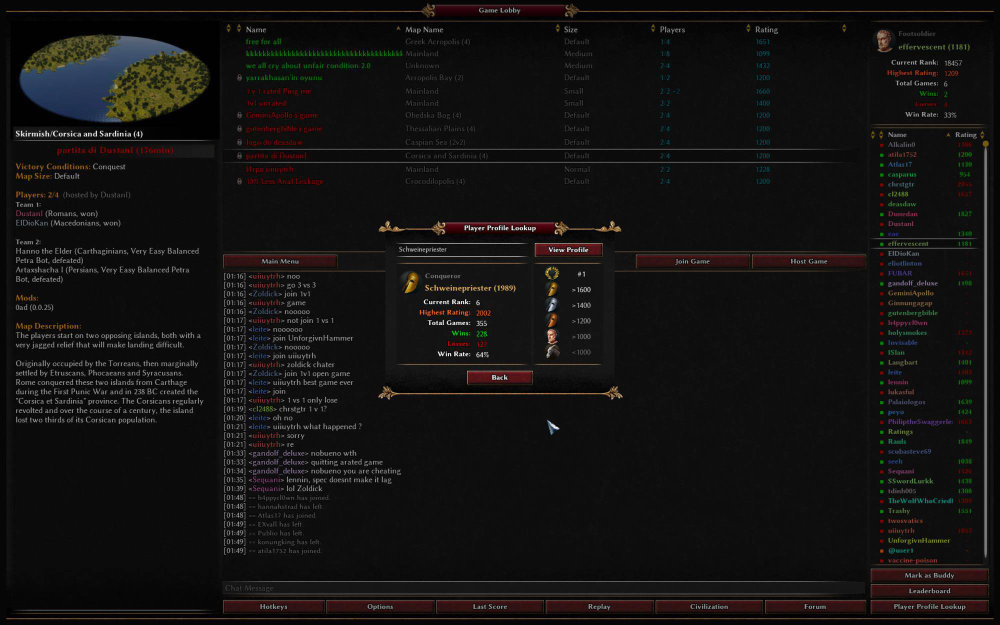
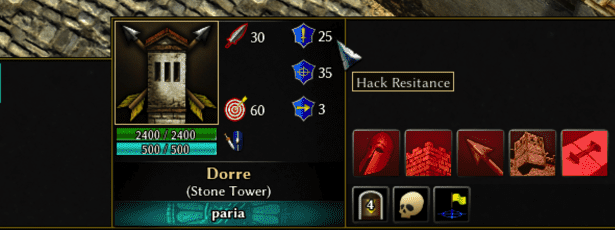

 
<!-- Title -->

# boonGUI 
User interface **mod** for the RTS game **0 A.D.**

<!-- 0 A.D. logo -->

<a href="https://play0ad.com">

  

<a href="https://play0ad.com/re-release-of-0-a-d-alpha-25-yauna/">Website</a> ·
<a href="https://github.com/0ad/0ad">GitHub</a> ·
<a href="https://peertube.debian.social/videos/watch/7d134d11-0b25-42bc-92dd-13c496863e8e">Project overview</a> ·
<a href="https://trac.wildfiregames.com/wiki/FAQ">FAQ</a>

---

## Screenshots
  

## Features
* **Main menu**
  * Cheat codes accesible through the game manual.
  * New background image
* **Camera**
  * Enter the view of a unit with a hotkey 
* **In-Game**
  * All fruits are more vivid and easier to see due to the increased saturation and brightness, some have also had their hue changed.
  * Chicken are 50% larger and fish were colored red.
  * Increased the size of weapon projectiles and the garrison flag on buildings.
  * All player colors are more vivid and easier to see on the minimap.
  * Larger buttons in the selection panel.
  * Larger and redesigned round minimap. The idle button displays the total number of idle workers.
  * Additional ingame stats about the players.
  * Timestamp notifications for players moving up a phase or completing one.
  * The HUD in the middle shows individual unit stats.
  * Option to skip the summary screen after a game ends.
* **Lobby**
  * Quick access buttons below the chat input.
  * Rating dependent icon & title for the profile.
  * Layout rearangements to improve the overall experience.
* **Summary screen**
  * Increased the size, recommend to use a 1920x1080 display.

### Version 1.6.5 featured on YouTube (6/Oct/21)
<!-- Newbie Rush -->

<a href="http://www.youtube.com/watch?v=vua47INwBb0">

## Installation
* Download the zip file or `git clone` this repo.
  * `git clone https://github.com/LangLangBart/boonGUI.git`
* Place it in your `/0ad/mods/` folder:
  * Linux: `~/.local/share/0ad/mods/`
  * macOS: `~/Library/Application\Support/0ad/mods/`
  * Windows: `~\Documents\My Games\0ad\mods\`
* Launch 0 A.D., click `Settings` and `Mod Selection`.
* Double-click `boonGUI`, click `Save Configuration` and `Start Mods`.

## Compatibility
Compatible with 0 A.D. Alpha 25

## Contributors
Motivation for this mod was the desire to learn javascript and create a tool for @mysticjim to help him create his YouTube videos. Since then many people have contributed to this mod, to all of those I wanted to say thank you.
* A complete makeover of the stats overlay was done thanks to @Islan.
* Thanks to @mysticjim, @Palaiologos and @seeh for constanely  testing and giving feedback.
* Providing code and helping with problems: @kaaduu, @maroder, @Nescio and @Schweini.
* Thanks to @badosu, @ffffff, @ffm2, @nani, @The Undying Nephalim and @wowgetoffyourcellphone for creating the following mods: Prodmod, fGod, ffm_visibility, Autociv, Hyrule Conquest and Delenda Est.
* As good guys @Imarok, @wraitii, @Freagarach, @vladislavbelov, @Angen and @Stan` pointed me in the right direction in IRC when I was stuck.

 

### If you want to contribute, give feedback or make suggestions, go ahead. 
### ❤️

