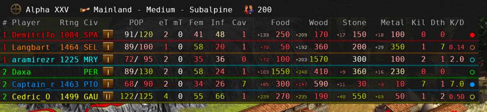
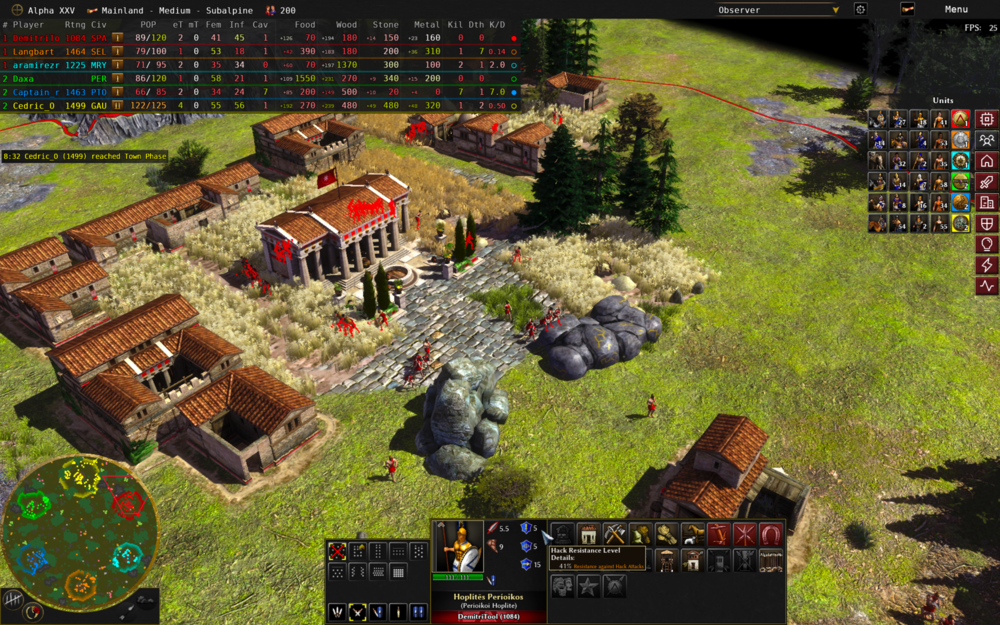
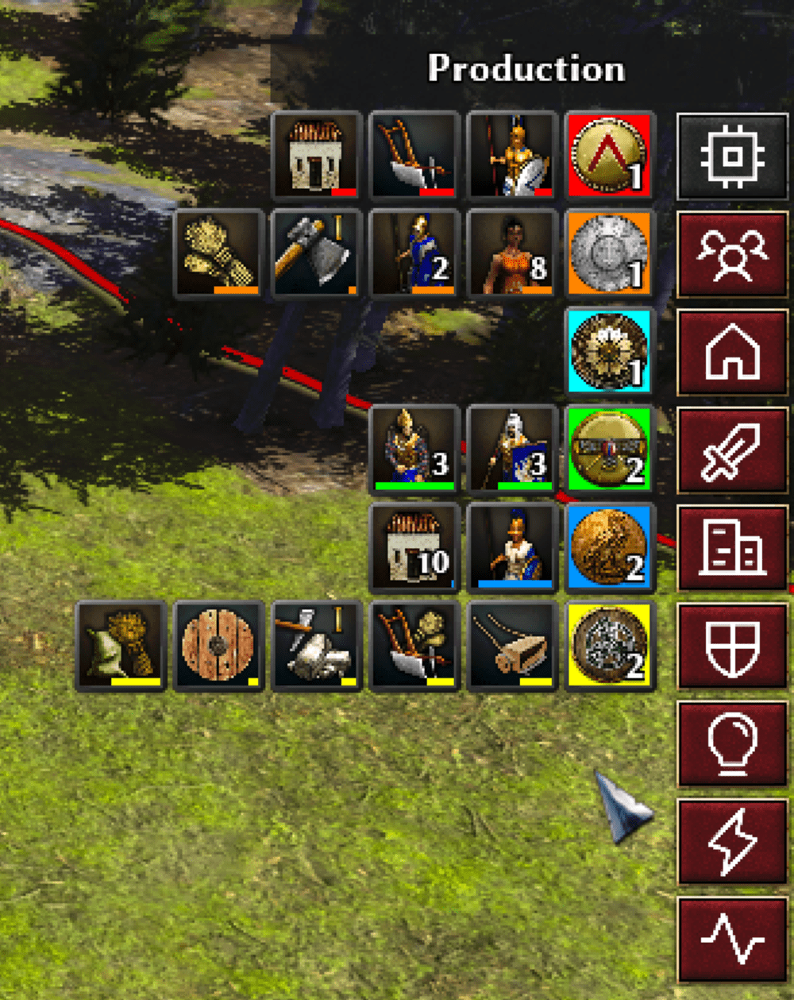
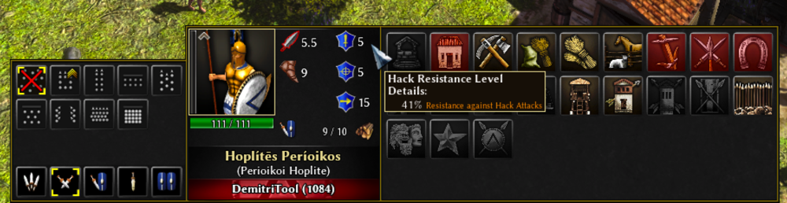

---

<!-- Title -->
<div align="center">
 
# boonGUI <br> 
[](https://github.com/LangLangBart/boonGUI/releases/latest) [](https://play0ad.com/download/) [](https://wildfiregames.com/forum/topic/37147-boongui-mod-compatible-with-a25)
 
User interface **mod** for the RTS game **0 A.D.**
</div>

<!-- 0 A.D. logo -->
<div align="center">
<p align="center">
<a href="https://play0ad.com">
</p>
 
<a name="menu"></a>
  <h4>
    <a href="https://play0ad.com/re-release-of-0-a-d-alpha-25-yauna/">Website</a>
    <span> | </span>
    <a href="https://github.com/0ad/0ad">GitHub</a>
    <span> | </span>
    <a href="https://peertube.debian.social/videos/watch/7d134d11-0b25-42bc-92dd-13c496863e8e">Project Overview</a>
    <span> | </span>
    <a href="https://trac.wildfiregames.com/wiki/FAQ">FAQ</a>
  </h4>
</div>

---

<div align="center">
 
### Screenshots
 
 <br>
 <br>

 
### Featured v2.0.0
<p>
<a href="https://www.youtube.com/channel/UCnpCp_OvNm0_FgD_5rSrxbw"></a>
 <a href="https://www.youtube.com/watch?v=fYFOZ2D28rM"></a>
</p>
 <p align="center">
<a href="https://www.youtube.com/watch?v=fYFOZ2D28rM"></a>
</p>

### Featured v1.6.5
<p>
<a href="https://www.youtube.com/channel/UC5Sf1aQufzzWATg9TJzg7mQ"></a>
 <a href="https://www.youtube.com/watch?v=vua47INwBb0"></a>
</p>
 <p align="center">
<a href="http://www.youtube.com/watch?v=vua47INwBb0"></a>
</p>

</div>
  
## Features
* **Main menu**
  * Cheat codes accessible through the game manual.
  * New background image
* **Camera**
  * Enter the view of a unit via a hotkey.
* **In-Game**
  * All fruits are more vivid and easier to see due to the increased saturation and brightness, some have also had their hue changed.
  * Chicken are 50% larger and fish were colored red.
  * Increased the size of weapon projectiles and the garrison flag on buildings.
  * All heroes have a large visible object flowing over their head, making them easier to see on the battlefield.
  * All player colors are more vivid and easier to see on the minimap.
  * Larger buttons in the selection panel.
  * Larger and redesigned round minimap. The idle button displays the total number of idle workers.
  * Additional ingame stats about the players.
  * Rally points are displayed for observers.
  * Timestamp notifications for players moving up a phase or completing one.
  * The HUD in the middle shows individual unit stats.
  * Option to skip the summary screen after a game ends.
* **Lobby**
  * Quick access buttons below the chat input.
  * Rating dependent icon & title for the profile.
  * Layout rearrangements to improve the overall experience.
* **Replay screen**
  * Adding a button next to the replay file path to quickly open the directory.
* **Summary screen**
  * Increased the size, recommend to use a 1920x1080 display.

## Installation
* Download the `zip file` or `git clone` this repo.
```
git clone https://github.com/LangLangBart/boonGUI.git
```
* Place it in your `/0ad/mods/` folder:
  * Linux: `~/.local/share/0ad/mods/`
  * macOS: `~/Library/Application\ Support/0ad/mods/`
  * Windows: `~\Documents\My Games\0ad\mods\`
* Launch 0 A.D., click `Settings` and `Mod Selection`.
* Double-click `boonGUI`, click `Save Configuration` and `Start Mods`.

#### Convenient installation
<details>
 <summary><b>Arch and Manjaro Linux users</b></summary>
<p>
 
You can skip the above steps and install the <a href="https://aur.archlinux.org/packages/0ad-boongui/">boonGUI package from the AUR</a>.
</p>
</details>

<details>
 <summary><b>macOS Installer</b></summary>
<p>

Paste it into your macOS terminal and press enter. The mod will be downloaded and placed in the correct 0ad mods folder.
```zsh
zsh -c "$(curl -fsSL https://raw.githubusercontent.com/LangLangBart/boonGUI/main/boongui_data/macOS_installer.sh)"
```
</p>
</details>

## Contributors
Motivation for this mod was the desire to learn javascript and create a tool for @mysticjim to help him create his YouTube videos. Since then many people have contributed to this mod, to all of those I wanted to say thank you.
* A complete makeover of the stats overlay was done thanks to @Islan.
* Thanks to @mysticjim, @Palaiologos and @seeh for constantly testing and giving feedback.
* Providing code and helping with problems: @andy5995, @kaaduu, @maroder, @Nescio, @Pretuer and @Schweini.
* Thanks to @badosu, @ffffff, @ffm2, @nani, @The Undying Nephalim and @wowgetoffyourcellphone for creating the following mods: Prodmod, fGod, ffm_visibility, Autociv, Hyrule Conquest and Delenda Est.
* Being good lads @elexis, @bb, @Imarok, @wraitii, @Freagarach, @vladislavbelov, @Silier and @Stan` pointed me in the right direction on the IRC #0ad channel when I got stuck.

<br>

<div align="center">

### If you want to contribute, give feedback or make suggestions, go ahead.
### ❤️

</div>
