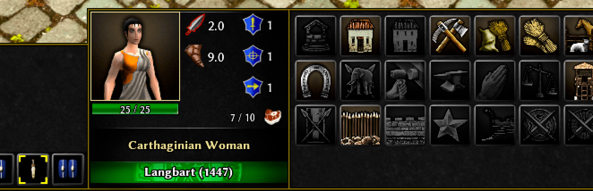
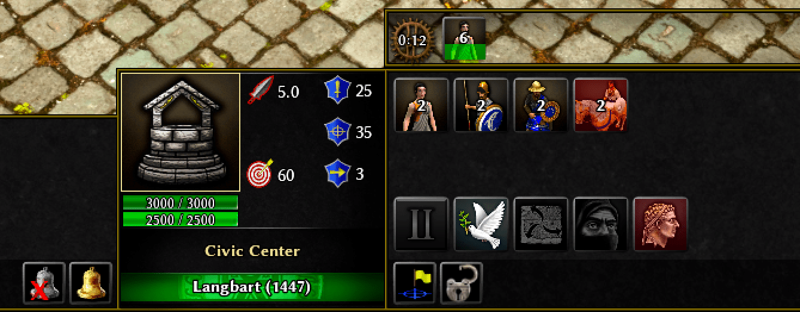

# boonGUI
GUI mod for the RTS game 0 A.D.
(Compatible with Alpha 25)

* 6/Oct/21: Video from the YouTube channel [0AD Newbie Rush](https://www.youtube.com/channel/UC5Sf1aQufzzWATg9TJzg7mQ)
* 10/Mar/21: [0 A.D. forum thread](https://wildfiregames.com/forum/topic/37147-boongui-mod-compatible-with-a25/) with detailed informations

Screenshots 
* InGame

* Lobby

* HUD

